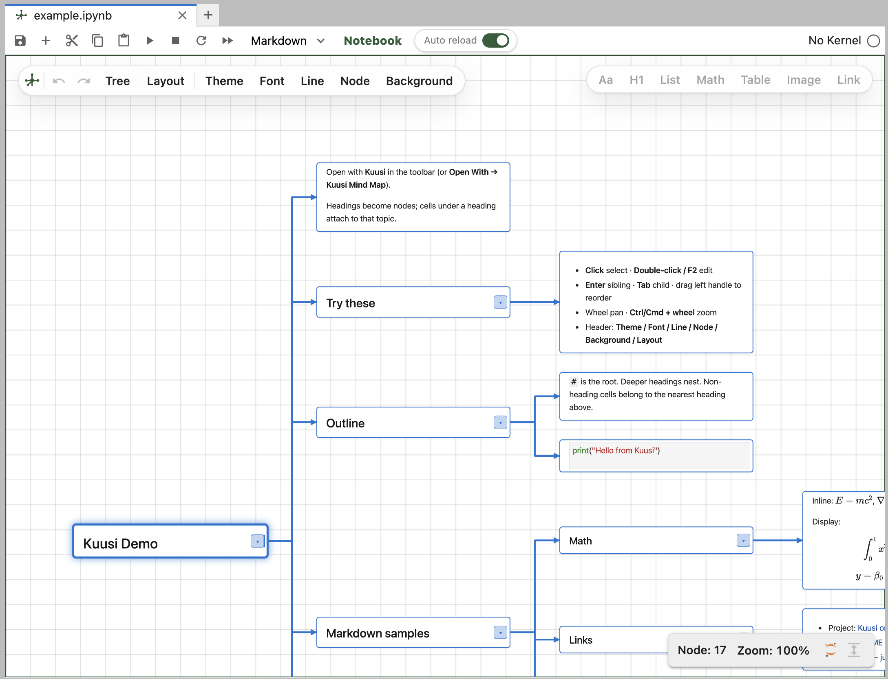
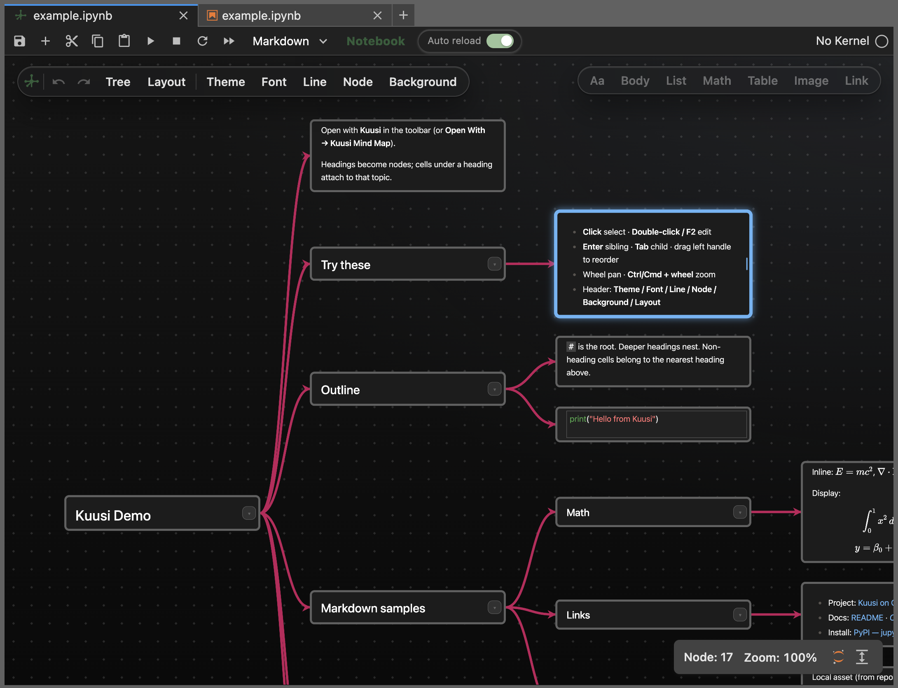
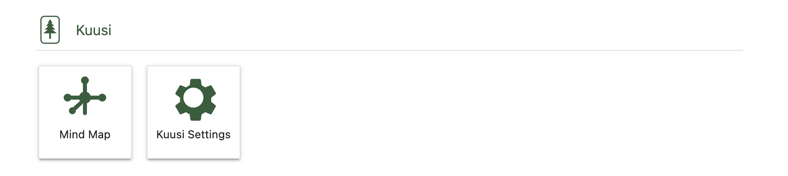

# Kuusi

*Kuusi* (Finnish for spruce) — Jupyter-native **notebook mind map**: rearrange `.ipynb` cells on a spatial canvas by markdown heading hierarchy, using **Jupyter's own cell renderers** (CodeCell / MarkdownCell — not a custom rich-text editor).

<p align="center">
  
</p>

<p align="center"><em>Overview — headings become branches; code and markdown cells attach as nodes</em></p>

<p align="center">
  
</p>

<p align="center"><em>Same notebook on a dark canvas with glass toolbars</em></p>

<p align="center">
  
</p>

<p align="center"><em>Launcher → Kuusi on 0.2.x — Mind Map and Settings (full-tier tiles unlock in 0.3.0)</em></p>

## Version

| Component | Version |
|-----------|---------|
| **Kuusi** | `0.2.6` |
| `kuusi-kernel` | `0.2.6` |
| `jupyterlab-kuusi` | `0.2.6` |

See [CHANGELOG.md](./CHANGELOG.md) for release notes.

## What’s in 0.2.x (core tier)

`pip install jupyterlab-kuusi` at **0.2.x** turns on **core** features only:

| Active on core | Description |
|----------------|-------------|
| **Mind Map** | Open `.ipynb` files in the Kuusi canvas (toolbar **Kuusi** or **Open With → Kuusi Mind Map**). |
| **Launcher → Kuusi** | **Mind Map** — create a notebook in the current folder and open it as a map. **Settings** — version, PyPI update check, community links, repository, about, and default openers (notebooks only). |
| **Page header (row 2)** | Left **mind map icon** opens the **keyboard shortcuts** guide; appearance and format toolbars behave as in earlier 0.2 releases. |

The same wheel also **bundles** Live PDF, TeX workspace, Markdown preview, image viewer, voice recorder, transfer-speed monitor, and ZIP compress/extract. Those plugins **do not register** until **0.3.0** (full tier). Jupyter server APIs for TeX, channel monitor, and compress follow the same rule — core installs log that full-tier APIs are disabled.

**Maintainers / QA (full tier locally):** in the browser console, run `localStorage.setItem('jupyterlab-kuusi:release-tier-override', 'full')` and reload JupyterLab. Remove the key or set `'core'` to return to PyPI behavior.

## Links
* Feedback: [Discourse](https://discourse.jupyter.org/t/kuusi-jupyterlab-notebook-mind-map-feedback-welcome/38802) 
* Community: [X.com @KussiMindMap](https://x.com/KussiMindMap)
* PyPI: [pypi.org/project/jupyterlab-kuusi/](https://pypi.org/project/jupyterlab-kuusi/)
* Github: [github.com/xianghancao/kuusi/](https://github.com/xianghancao/kuusi/) 
* Changelog: [Kuusi/CHANGELOG](https://github.com/xianghancao/kuusi/blob/main/CHANGELOG.md)

## Features

- **Native Jupyter cells** on a pannable, zoomable canvas
- **Heading-driven tree** — `#`–`###` roots/branches, nesting to depth 20 (levels 4+ keep Body chrome via metadata), other cells attach as Body under the current frame
- **Edit & structure** — Tab/Enter insert nodes, drag-and-drop reorder, two-way notebook sync
- **Appearance** — themes, fonts, line/border style, backgrounds; settings persist across refresh
- **Format toolbar** (edit mode) — headings, inline styles, lists, tables, images, links
- **Shortcuts, zoom, fullscreen** — XMind-style navigation; shortcuts from the page-header mind map icon; version and community links in **Launcher → Kuusi → Settings**

## Installation

### Requirements

| Component | Minimum |
|-----------|---------|
| **JupyterLab** | 4.x |
| **Python** | 3.9+ |

### Install with pip

```bash
pip install jupyterlab-kuusi
jupyter lab
```

Upgrade to the latest release:

```bash
pip install -U jupyterlab-kuusi
```

No Node.js is required for the PyPI install.

### LaTeX / PDF (optional, full tier from 0.3.0)

On **0.2.x PyPI**, TeX compile and Live PDF are **bundled but inactive** (see [What’s in 0.2.x](#whats-in-02x-core-tier)). From **0.3.0** onward, Kuusi can compile `.tex` files and preview PDFs with SyncTeX jumps. **`pip install jupyterlab-kuusi` never includes a TeX distribution** — install these on the machine that runs `jupyter lab`:

| Tool | Used for |
|------|----------|
| `pdflatex` | Default LaTeX → PDF compile |
| `xelatex` | Chinese / `fontspec` / `ctex` documents |
| `synctex` | PDF ↔ source line jumps |

**macOS** — [MacTeX](https://tug.org/mactex/) or `brew install --cask mactex-no-gui`

**Windows** — [MiKTeX](https://miktex.org/download) or [TeX Live](https://tug.org/texlive/)

**Linux** — e.g. `sudo apt install texlive-latex-extra texlive-xetex`

After installing TeX, restart JupyterLab. In a `.tex` editor, click **Help** in the Kuusi toolbar for platform-specific steps and PATH checks.

### Verify

```bash
jupyter labextension list | grep -i kuusi
```

You should see `jupyterlab-kuusi` enabled.

### Uninstall

```bash
pip uninstall jupyterlab-kuusi
```

### Open Kuusi

Open any `.ipynb` (try [`examples/example.ipynb`](examples/example.ipynb)), then either:

- Click **Kuusi** in the notebook toolbar, or
- **Right-click the file → Open With → Kuusi Mind Map**

You can keep the classic notebook view and Kuusi open on the same file side by side.

### Feedback

Questions, bugs, and feature ideas: [Jupyter Discourse topic](https://discourse.jupyter.org/t/kuusi-jupyterlab-notebook-mind-map-feedback-welcome/38802). Updates: [X @KussiMindMap](https://x.com/KussiMindMap). Clear reproducible bugs are also welcome on [GitHub Issues](https://github.com/xianghancao/kuusi/issues).

### Install from source (developers)

For local development or contributing, you need **Node.js ≥ 20**, **npm ≥ 10**, and **Git**. Clone the repo, activate the Python environment where JupyterLab is installed, then run:

```bash
git clone https://github.com/xianghancao/Kuusi.git
cd Kuusi
npm run jlab:install
jupyter lab
```

`npm run jlab:install` builds the extension, installs it with pip, and rebuilds JupyterLab.

This repo’s `scripts/kuusi-env.sh` pins **Anaconda** for install/dev (`KUUSI_PYTHON` / `KUUSI_JUPYTER`), so `pip list` matches the JupyterLab you start. Edit that file if your conda path changes.

Override for one command:

```bash
KUUSI_PYTHON=/path/to/python KUUSI_JUPYTER=/path/to/jupyter npm run jlab:install
```

Manual steps:

```bash
git clone https://github.com/xianghancao/Kuusi.git
cd Kuusi
npm install
npm run build:extension
pip install -e packages/jupyterlab-kuusi
jupyter lab
```

Run these from the **repository root** so the `kuusi-kernel` workspace package is available. See [CONTRIBUTING.md](./CONTRIBUTING.md) for the full workflow.

## Quick start

If you already installed Kuusi:

```bash
jupyter lab
```

Then open `examples/example.ipynb` with **Kuusi Mind Map** as described above.

## Using Kuusi

### Header (row 1)

Jupyter document toolbar: save, insert, cut/copy/paste, run, kernel, cell type, etc.

### Header (row 2)

| Area | Controls |
|------|----------|
| **Left** | **+**, **Mind map icon** (shortcuts), **Tree**, **Layout**, **Theme**, **Font**, **Line**, **Node**, **Background** |
| **Right** | Markdown **format** toolbar (visible in edit mode), see below |

#### Left toolbar

| Control | What it does |
|---------|----------------|
| **+** | Create a new notebook in the same folder and open it as a mind map |
| **Mind map icon** | Opens the **keyboard shortcuts** guide (navigation, formatting, notes) |
| **Tree** | Layout direction: ↓ ↑ → ← |
| **Layout** | Node spacing: Compact / Normal / Loose |
| **Theme** | Presets that stamp Line / Node / Background / Font: Notebook, Soft, Outline, Paper, Board, Black, Minimal |
| **Font** | Mind map typeface (notebook default, sans-serif, serif); **Edit** / **Display** size sliders (XXS–XXL) |
| **Line** | Connector line style, width, color |
| **Node** | Width (equal width switch), fill, border, corner, hover glow, selection glow |
| **Background** | Canvas pattern and color (including Ink for Black theme) |

All of the above (except zoom and fullscreen) are **saved automatically** and restored on refresh.

**Version, PyPI update badge, GitHub / PyPI links, Community (Discourse + X), install command, and default file openers** — **Launcher → Kuusi → Settings** (not the mind map page header).

#### Right format toolbar (edit mode, markdown cells)

| Control | What it does |
|---------|----------------|
| **Heading** | Outline heading level H1–H6 (changes mind map structure) |
| **Aa** | Bold, italic, underline, strikethrough, inline code, highlight, block quote, code block, clear formatting |
| **List** | Bulleted, dashed, numbered, check list |
| **Table** | Grid picker to insert a Markdown table |
| **Image** | Insert image via Markdown or HTML syntax |
| **Link** | Insert link via Markdown or HTML syntax |
| **Font color** | Preset swatches, custom color, remove color |

> **Heading** changes the outline tree. **Aa** and inline styles affect cell content only, not structure.

### Canvas

| Action | Behavior |
|--------|----------|
| **Single click** | Select node (persistent highlight) |
| **Double click** | Edit cell |
| **F2** | Enter edit mode |
| **Escape** | Exit edit mode |
| **Drag handle** (left edge) | Reorder in the outline tree |
| **Wheel** | Pan |
| **Ctrl/Cmd + wheel** | Zoom |
| **Bottom-right** | Node count, **Zoom: N%** (click to open slider with 20% ticks, 20%–200%), **Fullscreen** |

### Outline rules

1. The first `#` heading in the notebook becomes a **root** node.
2. Deeper headings nest under the nearest higher-level heading.
3. Non-heading cells belong to the current heading context.
4. Content before the first `#` (or orphan `##+` without an H1 parent) is ignored in the map.
5. **Tab** inserts a child node; **Enter** inserts a sibling. New empty nodes keep the correct tree level even without a `#` heading in the source yet.

## Architecture

```
.ipynb (shared INotebookModel)
    → kuusi-kernel: heading outline tree + dagre layout
    → jupyterlab-kuusi: canvas with native Jupyter cell widgets
```

No Tiptap, React Flow, or separate JSON sidecar in this line.

## Roadmap

Planned work after `0.2.0`. These items do not block the current release.

### `0.3.0`

#### Full tier

Enable bundled Live PDF, TeX, Markdown preview, Image, Voice, channel monitor, and compress features for all installs (today they ship in the wheel but stay off on 0.2.x — see [What’s in 0.2.x](#whats-in-02x-core-tier)).

#### Collapse branches

Core mind map capability. Much of the kernel and widget plumbing already exists (`collapsedIds` in layout, edges, and navigation); the remaining work is mostly UI and polish.

- Chevron on parent nodes to fold / unfold a branch
- Keyboard shortcut (e.g. Space on a selected topic)
- Badge showing hidden child count when collapsed
- Relayout after collapse so hidden subtrees free space
- Optional: collapse all / expand all / collapse to level N

#### Style themes

Theme presets now compose Line / Node / Background / Font settings (Notebook, Soft, Outline, Paper, Board, Black, Minimal). Optional next step: preview swatches in the Theme menu.

### `0.3.x` / `0.4.0` — Export image & PDF

Presentation and sharing enhancements, not required for day-to-day editing.

- **PNG** — current viewport or entire map (DOM snapshot)
- **SVG** — structure-only export (titles + connectors from layout data)
- **PDF** — from PNG or print stylesheet

Likely order: viewport PNG first, then structure SVG, then PDF.

## Development

Requires the [installation requirements](#requirements) above. See [CONTRIBUTING.md](./CONTRIBUTING.md) for the full workflow.

```bash
# Kernel unit tests + extension TypeScript build check + version sync
npm run test

# Production labextension build (requires JupyterLab)
npm run test:release-build

# JupyterLab smoke E2E (requires: npm run jlab:install + Playwright Chromium)
npm run test:e2e
```

From the repository root:

```bash
# One-shot build + install into the active Python environment
npm run jlab:install

# Watch mode (separate terminal)
npm run jlab:dev
jupyter lab
```

Build individual packages:

```bash
npm run build:kernel
npm run build:extension:lib
npm run build:extension      # dev labextension (local install)
npm run build:release        # production labextension (PyPI / release)
```

Verify the extension:

```bash
npm run jlab:verify
```

## Publishing to PyPI

Releases use [Trusted Publishing](https://docs.pypi.org/trusted-publishers/) — push a version tag and GitHub Actions uploads `jupyterlab-kuusi` to PyPI. No API token in the repo.

### One-time setup

1. On [pypi.org](https://pypi.org) → **Publishing** → add a **pending publisher** (or create it on the project after the first upload):
   - **PyPI project name:** `jupyterlab-kuusi`
   - **Owner:** `xianghancao`
   - **Repository:** `Kuusi`
   - **Workflow name:** `publish-pypi.yml`
   - **Environment name:** `pypi`
2. In GitHub → **Settings → Environments** → create environment **`pypi`** (optional: require reviewers).

### Release steps

```bash
# 1. Bump every version string to the same X.Y.Z
npm run check:versions

# 2. Update CHANGELOG.md / README version table, commit
git add -A && git commit -m "Release X.Y.Z …"

# 3. Tag and push (triggers .github/workflows/publish-pypi.yml)
git tag vX.Y.Z
git push origin main
git push origin vX.Y.Z
```

You can also run the workflow manually via **Actions → Publish PyPI → Run workflow**.

After it succeeds:

```bash
pip install -U jupyterlab-kuusi
```

## Repository layout

```
packages/
  kuusi-kernel/         # outline tree, layout, navigation
  jupyterlab-kuusi/     # JupyterLab extension + UI
docs/
  assets/               # Versioned README screenshots (e.g. 0.2.6/)
examples/
  example.ipynb         # hands-on feature tour
scripts/
CHANGELOG.md
CONTRIBUTING.md
```

## Contributing

Bug reports and feature ideas are welcome via [Issues](https://github.com/xianghancao/Kuusi/issues). **External pull requests are not accepted** before 1.0 — see [CONTRIBUTING.md](./CONTRIBUTING.md).

## License

BSD-3-Clause (`jupyterlab-kuusi`, `kuusi-kernel`)
